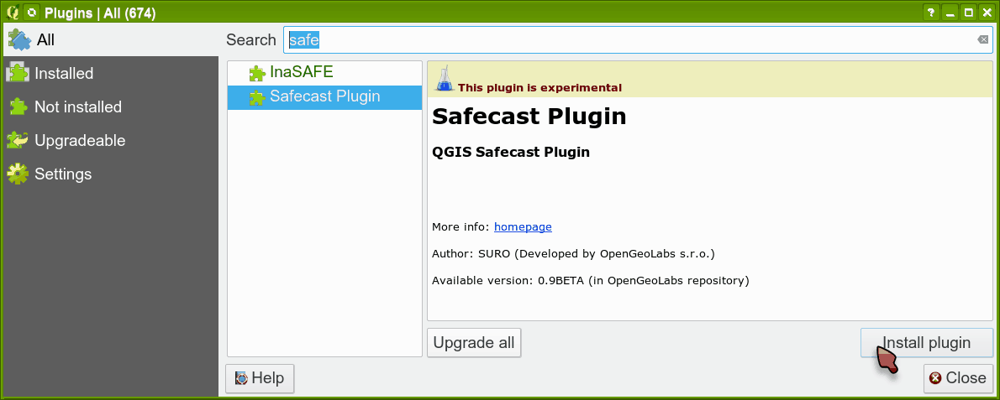

Installation
============

Go to :menuselection:`Plugins --> Manage and Install Plugins`:

.. figure:: images/004_plugins_menu.png
   :width: 400px

   Plugins menu.

You should have **Safecast Plugin** available in QGIS plugins selection
and you can install it:

   Plugins menu - install Safecast plugin.
   
and the plugin icon appears in the QGIS toolbar:

.. figure:: images/install_006_Safecast_plugin_in_QGIS.png

   Safecast plugin in QGIS toolbar.

and now the plugin is ready to use.
