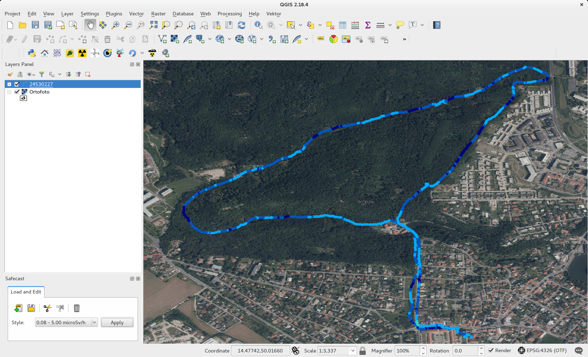
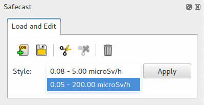

.. |mLoad| image:: images/tool_import.png
   :width: 1.5em
.. |mSave| image:: images/tool_save.png
   :width: 1.5em
.. |mSelect| image:: images/tool_select.png
   :width: 1.5em
.. |mDeselect| image:: images/tool_deselect.png
   :width: 1.5em

Tool description
================

Load LOG file
-------------

A Safecast layer (a LOG file) can be loaded from main toolbar by
|mLoad| :sup:`Import Log file as new layer`. An input file is loaded
into QGIS as a new vector point layer. The name of new layer
coresponds with input file (without LOG extension). Measured points
are categorized based on ADER value (see :doc:`intro`). By default,
points are categorized in a range from 0.08 to 5.00 microSv/h. See
figure below.

        
   *Fig: Loaded Safecast layer with default style applied.*

Alternative style (0.05 - 200.00 microSv/h) can be chosen from style
selectored and activated for selected layer by `Apply` button.

   *Fig: Style selector to apply predefined point styles.*

Browse attribute data
---------------------

Delete measured points
----------------------

Save changes into new LOG file
------------------------------
