.. |mLoad| image:: images/tool_import.png
   :width: 1.5em
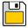
.. |mSelect| image:: images/tool_select.png
   :width: 1.5em
.. |mDeselect| image:: images/tool_deselect.png
   :width: 1.5em

User Manual
===========

Load LOG file
-------------

A Safecast layer (a LOG file) can be loaded from the main toolbar by
|mLoad| :sup:`Import Log file as new layer`. An input file is loaded
into QGIS as a new vector point layer. The name of new layer
corresponds with the input file (without LOG extension). Measured
points are categorized based on the dose rate (ADER)
value (see :doc:`intro`). By default, the points are categorized in a
range from 0.08 to 5.00 microSv/h. See the figure below.

.. figure:: images/001_log_data_no_bgr.png
        
   Loaded Safecast layer with the default style applied.

The alternative style (0.05 - 200.00 microSv/h) can be chosen from the
style selector and activated for a selected layer by `Apply` button.

.. figure:: images/002_style-selector.png

   Style selector to apply predefined point styles.

The default style (0.08 to 5.00 microSv/h) was designed for
measurements at low dose rate levels (natural background) with more
categories for lower values to distinguish natural background
variations.

.. note:: The color ramp is derived from the default `SAGA GIS
          <http://saga-gis.org>`__ color style which has proved to be optimal
          for most of our tasks.

The second available style (0.05 - 200.00 microSv/h) was designed to
mimic the Safecast Tile Map default style. This is useful for areas
with higher dose rate levels like Fukushima or Chernobyl.

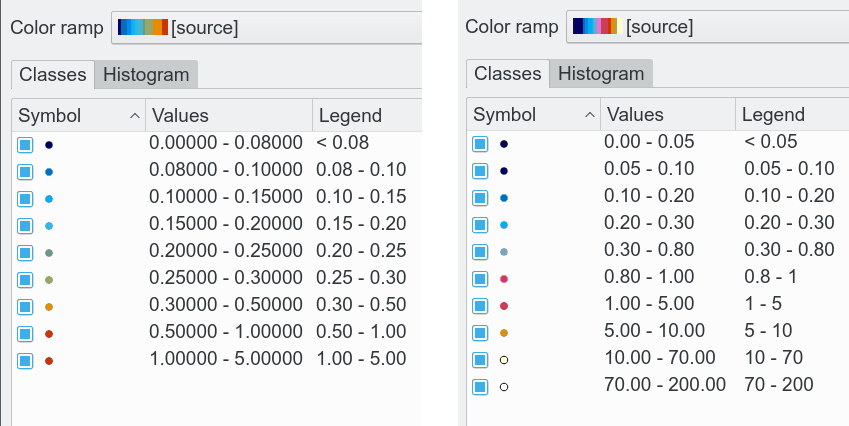
        
   Predefined point styles - 0.08 to 5.00 microSv/h on the left and
   0.05 - 200.00 microSv/h on the right.

.. tip:: If none of above mentioned styles fits your needs and you want to
         create your own style, then use native QGIS styling capabilities to be
         available in the programme (right click on layer name, choose
         ``Properties`` from the context menu, then go to ``Style`` tab).

Add background map (Google, Bing, OpenStreetMap or offline)
-----------------------------------------------------------

By default, there is no background map - you need to add it from
offline data (vector or raster files) or to add a layer from online
map service like `Google <http://maps.google.com>`__ or `OpenStreetMap
<http://openstreetmap.org>`__, using *OpenLayers plugin*.

Go to :menuselection:`Plugins --> Manage and Install Plugins`:

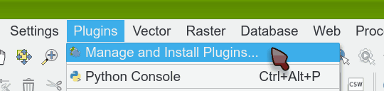

   Plugins menu.

Write ``openlayers`` in Search field, select ``OpenLayers Plugin`` and
start installation, using ``Install Plugin`` button.

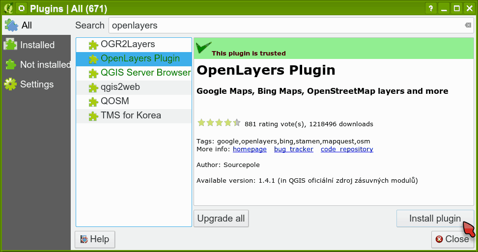
        
   OpenLayers Plugin installation.

Go to the menu :menuselection:`Web --> OpenLayers Plugin` and choose
the map layer you want to add - in this case it is ``Google Hybrid``:

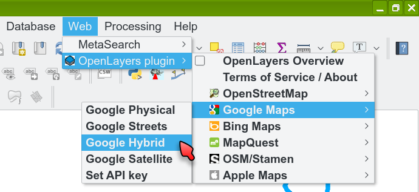
        
   OpenLayers Plugin - add layer to map.

The map layer loads on the top, so it covers your data:

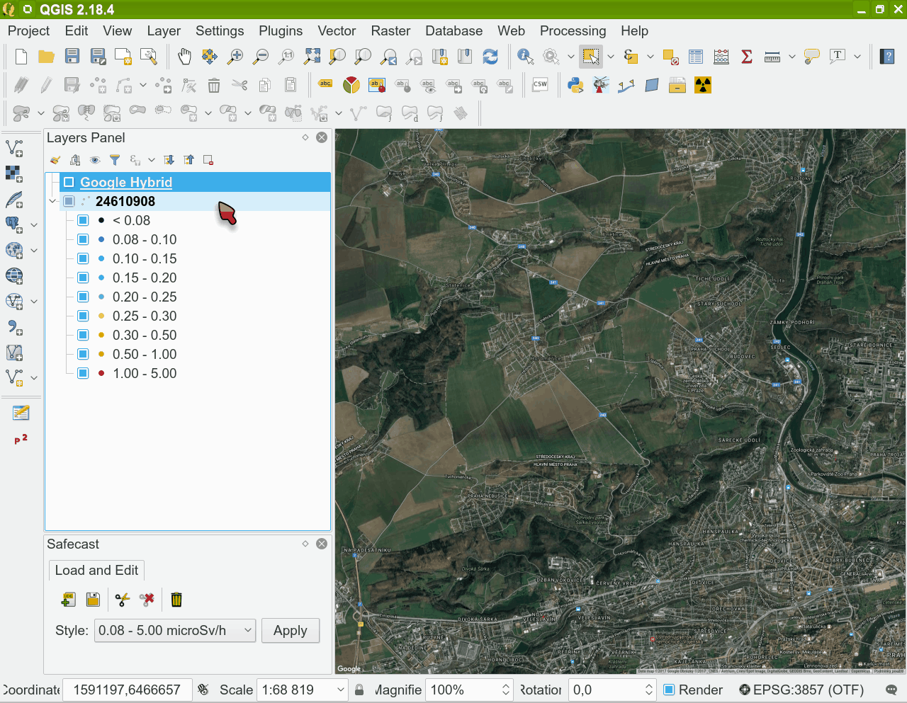
        
   Newly added layer covers your data.

To fix this, you just need to drag the background map layer to the
bottom with the mouse.

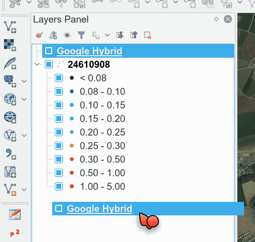

   Drag the background layer to the bottom.

Finally you get your measurements to be displayed on the Google map
layer.

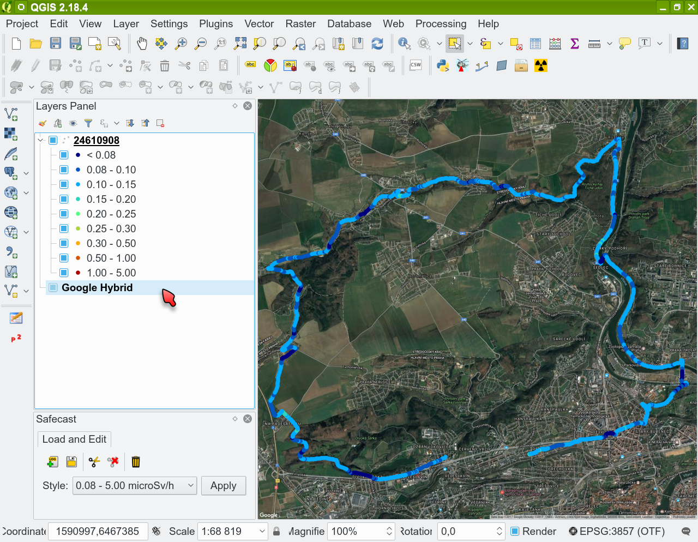
        
   Loaded Safecast layer with the default style applied.

**Offline maps**

QGIS can use various offline data sources. Depending on type of your
data (raster / vector), level of details and spatial extent, the time
needed to refresh the map window after panning or zooming can increase
significantly.

Browse attribute data
---------------------

You can display all loaded data from the LOG file in a table form - in
GIS programs; it is called *Attribute table*.

.. note:: This is not a feature of Safecast plugin - it is a standard,
          built-in QGIS feature.

In Layers Panel select particular layer, using a mouse. Then click a
right mouse button to show the context menu and select ``Open
Attribute Table``.

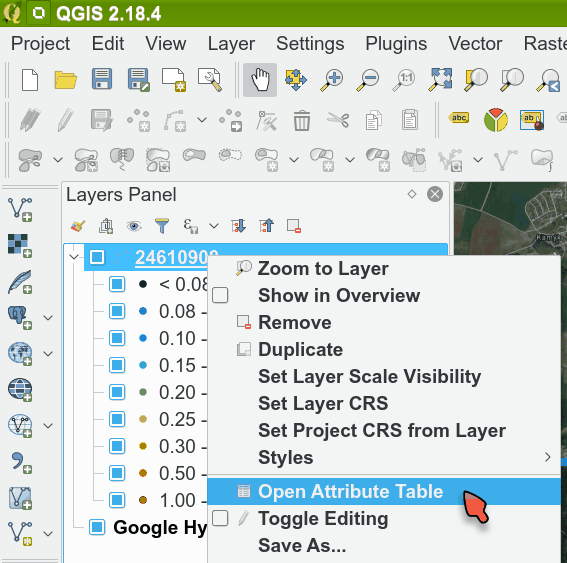

   Opening the attribute table.

Then the attribute table appears:

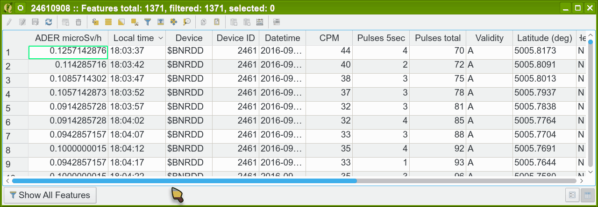
        
   Attribute table data.

.. _additional-columns:

The table contains both all data imported from the bGeigie LOG file
and several additional ones calculated by the plugin - dose rate,
local time etc.

.. _delete-points:

Delete measured points
----------------------

The plugin allows a user to select and remove particular measured
points and then to save the corrected set as a new LOG file for
uploading to Safecast web map. No modification of the data values is
possible.

There are various reasons for using this feature:

#. After returning home, you forgot to switch off your bGeigie. More
   than half of the data uploaded to Safecast map to be unnecessary.
#. It is comfortable to switch on bGeigie at home, but you do not want
   to let all people know the exact location of your home. You need to
   begin either data measurement later, or to end it earlier.
#. Some points have missing or incorrect coordinates; you want to drop
   them from the dataset.
#. You have one LOG file containing several trips measured under
   different conditions. You need to split them into separate files
   for an upload to Safecast API and to provide a different
   description (height, facing etc.) for each one.

First select the layer with loaded LOG data you want to trim:

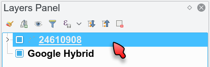

   Select the layer to be trimmed.

Then use the |mSelect| :sup:`Select features to cut` button to select
the points, you want to remove by simply drawing a rectangle over
them:

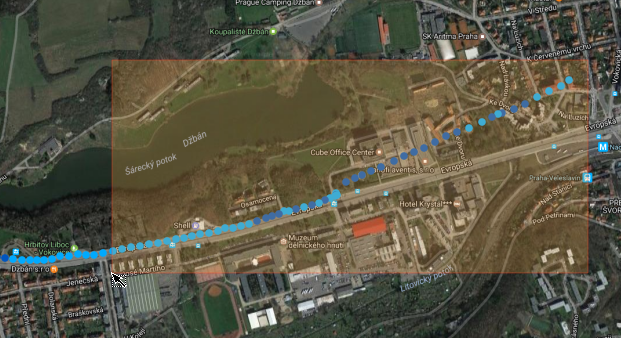
        
   Select features to cut.

.. tip:: Use the panning and zooming tools to zoom or move the map to
         a desired area and scale. Only while activating panning tool, you can
         also use a mouse wheel to zoom in or out and arrow keys to move.

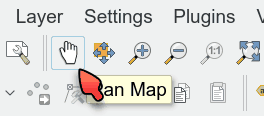

   QGIS panning and zooming tools.

All selected points will turn yellow:

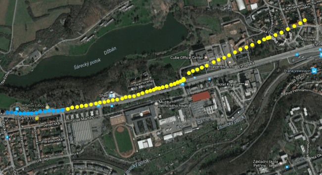
        
   Selected points are highlighted with yellow color.
   
Click the |mDelete| :sup:`Delete selected features` button to delete
selected points and confirm the deletion:

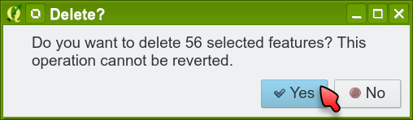

   Deleting points.

Then the selected points are deleted.

.. important:: Since the plugin loads the data in the memory (a
               separate working file is planned for future versions) any changes does
               not affect the source LOG file. When a user wants to keep changes in
               the LOG file, it is necessary to save them into a new LOG file.

Save changes into new LOG file
------------------------------

Click the |mSave| :sup:`Save layer as new LOG file` button to save the
data as a new LOG file. We recommend to use a different file name. For
example, the source data file is *24610908.LOG*; we save the trimmed
LOG file as *24610908_upload.LOG*. By this means it marks that this
file is ready for an upload to Safecast API.

.. figure:: images/017_save_LOG_file.png

   Save layer as LOG file.

.. note:: While saving into LOG files, additional columns (see
          :ref:`[1] <additional-columns>`) will not be saved. The only way
          to keep them is to save the layer in other format selected
          from the context menu in QGIS, because the plugin allows you
          to save them only as a LOG file.

How to show values of particular point using Identify Features tool
-------------------------------------------------------------------

If you want to show an exact value (dose rate, CPM and others) for a
particular measured point, then ``Identify Features`` is the right tool for you.

.. note:: This is not a feature of Safecast plugin - it is a standard,
          built-in QGIS feature.

First select the layer with the loaded LOG data you want to identify:

   Select the layer to identify.

Then activate the ``Identify Features`` tool in the main toolbar:

.. figure:: images/018_identify_icon.png

   Activate Identify tool.

If you cannot see separate points, then use the panning and zooming
tools mentioned in :ref:`Delete measured points <delete-points>`
section to achieve a needed map scale. Then activate ``Identify tool``
again. Click on the point:

.. figure:: images/019_identify_point.png

   Using Identify tool.

And QGIS will display Identify Results window with all data
(attributes) for the selected point.

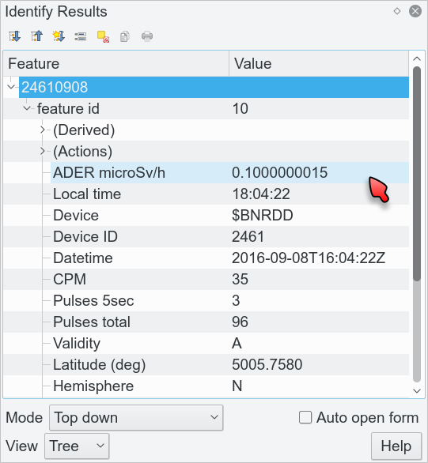

   Identify Results window.
